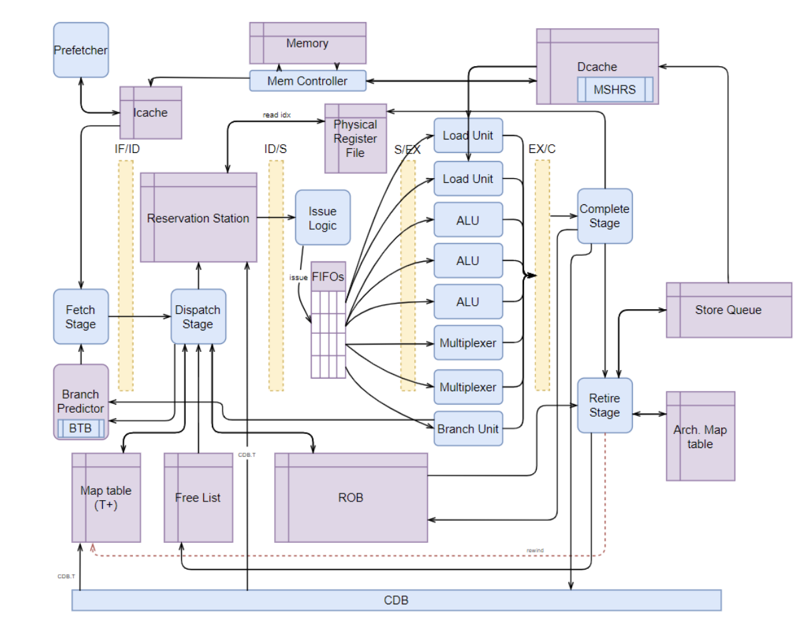

# CSEE W4824: Computer Architecture Final Project

## 📋 Team Information
- **Columbia University - Spring 2025**
- **Team Number**: Group 6
- **Team Members**:
  - Yuan Jiang (yj2848@columbia.edu)
  - Yuxi Zhang (yz4935@columbia.edu)
  - Junfeng Zou (jz3850@columbia.edu)
  - Lingxi Zhang (lz2991@columbia.edu)
  - Zhelin Su (zs2709@columbia.edu)
  - Hongrui Huang (hh3084@columbia.edu)

## 📚 Project Overview

This project implements an out-of-order, 32-bit processor based on a 3-way scaled R10K microarchitecture.
It supports the RV32IM ISA, featuring:
- 3-way scalar pipeline
- Advanced Branch Predictor
- Non-blocking Icache(256Bytes)
- Non-blocking 2-way 16-set Dcache(256Bytes) with MSHRs support
- Prefetch
- Store Queue
- Standard CSR operations and system calls

The design includes key components such as fetch, dispatch, issue, functional units, complete, retire stages, reorder buffer (RoB), reservation stations (RS), physical register file (PR), and memory systems. 

**Top-Level Architecture**


## 🏆 Project Results
- simulation (Minimum Clock: XXXns):   Sim Total Passed **33 out of 33**
- synthesis (Minimum Clock: XXXns):   Syn Total Passed **33 out of 33**

## ⏰ Clock Period (default: 250ns)

- Adjust it in `Makefile`

## 🧩 Module Testbench
To test a specific module using its corresponding testbench located in the `test/XXX_test.sv` folder:

1. Identify the testbench file for the module you want to test (e.g., `test/alu_test.sv`, `test/cache_test.sv`, etc.)
2. Run the following command to compile and simulate the module:
   ```bash
   make XXX.out
   ```
   - Replace XXX with the module name (e.g., alu, cache)
   - This will automatically run the corresponding `XXX_test.sv` file
3. The simulation will display **"pass"** or **"failed"** based on the test results in the terminal.
4. After testing, it is recommended to clean up the generated files to avoid confusions with later simulations:
   ```bash
   make nuke
   ```

## 🚀 Run Simulation

### 🔹 Run a Single Test Program

To test one specific program located in the `programs/` folder:

1. Open your terminal and navigate to your project directory:
   ```bash
   cd /path/to/your/project
   ```
2. Modify the `program=dft` in `sim_test.sh` script to specify the name of the program you want to test.
3. Run the script:
   ```bash
   sh sim_test.sh
   ```
   This will:
   - Automatically execute `make XXX.out`
   - Compare the generated memory output with the reference in the `sim_ground_truth/` folder.
4. The result will display **"pass"** or **"failed"** in the terminal.
5. To clean all generated files:
   ```bash
   make nuke
   ```

---

### 🔹 Run All 33 Test Programs

To test all programs in the `programs/` folder at once:

1. Navigate to your project directory:
   ```bash
   cd /path/to/your/project
   ```
2. Run the batch testing script:
   ```bash
   sh sim_test_all.sh
   ```
   This will:
   - Automatically run `make XXX.out` for each program
   - Compare each output to the ground truth files in the `sim_ground_truth/` folder.
3. You will see a summary of results, e.g., **33/33 passed**.
4. To avoid cluttering the terminal, detailed output and the final score will also be saved to:
   ```
   sim_all_results.txt
   ```
5. To clean all generated files, including the result log:
   ```bash
   make nuke
   ```
---

## 🚀 Run Synthesis (takes a few hours)

### 🔹 Run a Single Test Program

To test one specific program located in the `programs/` folder:

1. Open your terminal and navigate to your project directory:
   ```bash
   cd /path/to/your/project
   ```
2. Modify the `program=dft` in `syn_test.sh` script to specify the name of the program you want to test.
3. Run the script:
   ```bash
   sh syn_test.sh
   ```
   This will:
   - Automatically execute `make XXX.syn.out`
   - Compare the generated memory output with the reference in the `syn_ground_truth/` folder.
4. The result will display **"pass"** or **"failed"** in the terminal.
5. To clean all generated files:
   ```bash
   make nuke
   ```

---

### 🔹 Run All 33 Test Programs

To test all programs in the `programs/` folder at once:

1. Navigate to your project directory:
   ```bash
   cd /path/to/your/project
   ```
2. Run the batch testing script:
   ```bash
   sh syn_test_all.sh
   ```
   This will:
   - Automatically run `make XXX.syn.out` for each program
   - Compare each output to the ground truth files in the `syn_ground_truth/` folder.
3. You will see a summary of results, e.g., **33/33 passed**.
4. To avoid cluttering the terminal, detailed output and the final score will also be saved to:
   ```
   syn_all_results.txt
   ```
5. To clean all generated files, including the result log:
   ```bash
   make nuke
   ```
---

## 🔍 CPI and TPI Extraction Script

### Usage

You **must** provide the clock period as a **single-digit decimal** (e.g., `15.0`), otherwise the script will exit with an error.
```bash
sh get_cpi.sh 15.1
```
### How
The script extracts the following performance metrics from each `.out` file:
- **Cycles**: Total cycles executed before system halt.
- **Instructions**: Number of instructions executed.
- **CPI** (Cycles Per Instruction): Reported by the simulation.
- **TPI** (Time Per Instruction): Computed as `CPI × Clock_Period` in nanoseconds.

If the instruction count is zero, both CPI and TPI will be recorded as `0.000000` to avoid division errors.

After processing all files, the script appends a final row labeled **`Average`**, containing:
- The total cycles,
- The total instructions,
- The average CPI (`total_cycles / total_instrs`),
- The average TPI.

### Cleaning Up
Run `make nuke` will delete `cpi_report.csv` file.